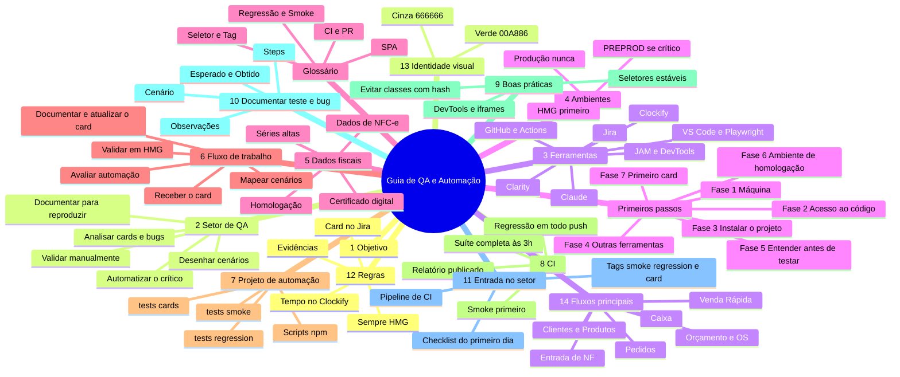

# Mapa mental — visão geral

Desenho dos ramos principais do guia de QA. O GitHub renderiza o diagrama abaixo automaticamente.
O detalhe completo de cada ramo está em [`guia-onboarding-qa.md`](./guia-onboarding-qa.md).
Imagem do mesmo mapa, para abrir fora do GitHub: [`visao-geral.png`](./visao-geral.png).

Para alterar o mapa, edite o texto em `guia-onboarding-qa.md` (fonte de verdade) e ajuste o diagrama abaixo.

